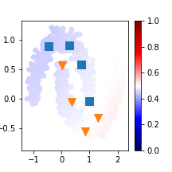

# VAT
* Virtual Adversarial Training: a Regularization Method for Supervised and Semi-supervised Learning - 
https://arxiv.org/abs/1704.03976

# Sample Performance   

# Usage   
See [here](VAT.ipynb)
