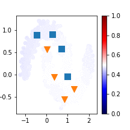

# VAT
VAT implementation by pytorch.   
If you input the model and data to the forward function, the loss from the perturbed input will be returned.

*class VATLoss(nn.Module)*   
Parameters:   
  xi: hyperparameter of VAT. a small float for the approx. of the finite difference method.   
  eps: hyperparameter of VAT. the value for how much deviate from original data point X.   
  ip: a number of power iteration for approximation of r_vadv. The default value 2 is sufficient.   

Method:   
def forward(self, model, x):   
  return value is KL-div between normal inputs (x) and perturbed inputs (x+r).

**Paper:**
* Virtual Adversarial Training: a Regularization Method for Supervised and Semi-supervised Learning - 
https://arxiv.org/abs/1704.03976

# Sample Performance   

# Usage   
See [here](VAT.ipynb)
